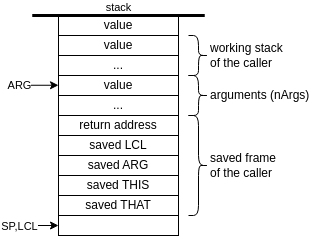
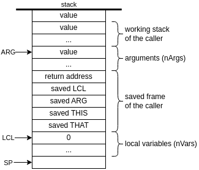
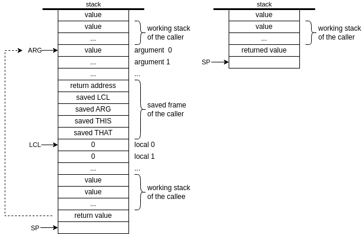

# NAND to Tetris Course Notes

## HACK Machine Language
### A-instruction
`@<x>`, where `<x>` is either a constant, or a symbol bound to a constant
- Sets the **A** register to `<x>`
- Side effects:
  - **RAM[A]** becomes the selected RAM location
  - **ROM[A]** becomes the selected ROM location
### C-instruction 
`<dest> = <comp> ; <jump>`, `<dest> =` and `; <jump>` optional \
where \
`<comp>` = 
```
0, 1, -1, D, A, !D, !A, -D, -A, D+1, A+1, D-1, A-1, D+A, D-A, A-D, D&A, D|A,
             M,     !M,     -M,      M+1,      M-1, D+M, D-M, M-D, D&M, D|M 
```
`<dest>` =
```
null, M, D, DM, A, AM, AD, ADM
```
`<jump>` =
```
null, JGT, JEQ, JGE, JLT, JNE, JLE, JMP
```
- Computes the value of `<comp>` and stores the result in `<dest>`;
- If `<comp> <jump> 0`, branches to **ROM[A]**

## Virtual Machine - Stack Machine
### Arithmetic / Logical Commands

 command | operation | returns
---------|-----------|---------
 `add`    | x+y       | integer
 `sub`    | x-y       | integer
 `neg`    | -y        | integer
 `eq`     | x==y      | boolean
 `gt`     | x>y       | boolean
 `lt`     | x<y       | boolean
 `and`    | x AND y   | boolean
 `or`     | x OR y    | boolean
 `not`    | NOT y     | boolean
> Non-zero value considered true and zero value considered false for boolean returns

### Push / Pop Commands
- `push <segment> <index>`
- `pop <segment> <index>`

#### Virtual Memory Segments
- constant \
  `push constant <i>`: `RAM[SP] = i; SP++`

- local / argument / this / that \
  `push <segment> <i>`: `addr = <BASE_ADDR> + i; RAM[SP] = RAM[addr]; SP++` \
  `pop <segment> <i>`: `addr = <BASE_ADDR> + i; SP--; RAM[addr] = RAM[SP]`
  `<segment>` | `<BASE_ADDR>`
  ------------|---------------
   local      | `LCL`
   argument   | `ARG`
   this       | `THIS`
   that       | `THAT`

- static \
  `push/pop static <i>`: `push/pop Xxx.i` while translating `Xxx.vm` file

- temp \
  `push/pop temp <i>`: `push/pop RAM[5+i]`

- pointer \
  `push/pop pointer 0`: `push/pop THIS`\
  `push/pop pointer 1`: `push/pop THAT`

### Branching Commands
- `label <label>`: Marks the destination of `goto` commands
- `goto <label>`: Jump to execute the command just after the `<label>`
- `if-goto <label>`: 
  1. let *cond* = `pop`
  2. if *cond* != 0, jump to execute the command just after the `<label>`; else, execute the next command

### Function Commands
- `call <functionName> <nArgs>`: \
Calls function `<functionName>` for its effect, informing that `<nArgs>` argument values were pushed onto the stack
> Convention: The caller must push `<nArgs>` arguments to stack before the `call` command
- `function <functionName> <nVars>`: \
Here starts the declaration of function `<functionName>` with `<nVars>` local variables 
- `return`: \
The *return value* will replace (in the stack) the argument values that were pushed by the caller before the `call`; \
Control will be transferred back to the caller; \
Execution will resume with the command just after the call
> Convention: The callee must push a value onto the stack before a `return` command
### Translation: `call` / `function` / `return`
```c
  // call <functionName> <x>
  /* Creates return address label `<thisFunctionName$ret.1>`;
   * Saves the return address and the caller's segment pointers */
  goto <functionName>       // injected branching to the called function
(<thisFunctionName$ret.1>)  // injected return address label
```
```c
// function <functionName> <y>
(<functionName>) // injected function's entry point label
  /* assembly code that initializes the function's <y> local variables */

  // ...
  /* assembly code that handles the functions body */
  
  // return
  /* Retrives the saved return address */
  /* Replaces the arguments pushed by the caller with the return value */
  /* Reinstates the segment  pointers of the caller */
  goto <thisFunctionName$ret.1> // injected branching back to the calling site
```
#### **`call`**

```c
  // call functionName nArgs
  // Save the return address
  push retAddrLabel // Generates and pushes this label
  // Save the caller's segment pointers
  push LCL
  push ARG
  push THIS
  push THAT
  // Reposition ARG (for the callee)
  ARG = SP - 5 - nArgs
  // Reposition LCL (for the callee)
  LCL = SP
  // Go to execute the callee's code
  goto functionName
(retAddrLabel)
```
#### **`function`**

```c
  // function <functionName> <nVars>
  // Inject an entry point label into the code
(<functionName>)
  // Initialize the `local` segment of the callee
  // push <nVars> 0 values
  push 0
  ...
  push 0 
```

#### **`return`**

```c
  // *endFrame* and *retAddr*: temporary variables
  // *addr denotes RAM[addr]
  endFrame = LCL            // gets the address at the frames end
  retAddr = *(endFrame - 5) // gets the address of return address
  // Replace the arguments that the caller push with the value returned by the callee
  *ARG = pop()  // puts the return value for the caller 
  // Replace the memory used by the callee
  SP = ARG + 1  // Reposition SP
  // Replace the caller's segment pointers
  THAT = *(endFrame - 1)  // Restore THAT
  THIS = *(endFrame - 2)  // Restore THIS
  ARG = *(endFrame - 3)   // Restore ARG
  LCL = *(endFrame - 4)   // Restore LCL
  // Jump to the return address
  goto retAddr
```

### Standard VM Mapping
 Symbol / segment                      | RAM location
---------------------------------------|--------------
 SP                                    | 0
 LCL                                   | 1
 ARG                                   | 2
 THIS                                  | 3
 THAT                                  | 4
 temp segment                          | 5 - 121
 general purpose registers (R13 - R15) | 13 - 15
 static segment / Xxx.i                | 16 - 255
 Stack                                 | 256 - 2047

### Symbols
 - `SP`
 - `LCL`, `ARG`, `THIS`, `THAT`
 - `R13`, `R14`, `R15`
 - `Xxx.i`: `static i` in file `Xxx.vm`
 - `Xxx.functionName`: function `functionName` in file `Xxx.vm`
 - `Xxx.functionName$ret.i`: `i`-th instance of return in function `functionName` of file `Xxx.vm`
 - `Xxx.functionName$label`: label `label` in function `functionName` of file `Xxx.vm`
