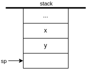

# NAND to Tetris Course Notes

## HACK Machine Language
### A-instruction
`@<x>`, where `<x>` is either a constant, or a symbol bound to a constant
- Sets the **A** register to `<x>`
- Side effects:
  - **RAM[A]** becomes the selected RAM location
  - **ROM[A]** becomes the selected ROM location
### C-instruction 
`<dest> = <comp> ; <jump>`, `<dest> =` and `; <jump>` optional \
where \
`<comp>` = 
```
0, 1, -1, D, A, !D, !A, -D, -A, D+1, A+1, D-1, A-1, D+A, D-A, A-D, D&A, D|A,
             M,     !M,     -M,      M+1,      M-1, D+M, D-M, M-D, D&M, D|M 
```
`<dest>` =
```
null, M, D, DM, A, AM, AD, ADM
```
`<jump>` =
```
null, JGT, JEQ, JGE, JLT, JNE, JLE, JMP
```
- Computes the value of `<comp>` and stores the result in `<dest>`;
- If `<comp> <jump> 0`, branches to **ROM[A]**

## Virtual Machine - Stack Machine
### Arithmetic / Logical Commands

 command | operation | returns
---------|-----------|---------
 `add`    | x+y       | integer
 `sub`    | x-y       | integer
 `neg`    | -y        | integer
 `eq`     | x==y      | boolean
 `gt`     | x>y       | boolean
 `lt`     | x<y       | boolean
 `and`    | x AND y   | boolean
 `or`     | x OR y    | boolean
 `not`    | NOT y     | boolean
> Non-zero value considered true and zero value considered false for boolean returns

### Push / Pop Commands
- `push <segment> <index>`
- `pop <segment> <index>`

#### Virtual Memory Segments
- constant \
  `push constant <i>`: `RAM[SP] = i; SP++`

- local / argument / this / that \
  `push <segment> <i>`: `addr = <BASE_ADDR> + i; RAM[SP] = RAM[addr]; SP++` \
  `pop <segment> <i>`: `addr = <BASE_ADDR> + i; SP--; RAM[addr] = RAM[SP]`
  `<segment>` | `<BASE_ADDR>`
  ------------|---------------
   local      | `LCL`
   argument   | `ARG`
   this       | `THIS`
   that       | `THAT`

- static \
  `push/pop static <i>`: `push/pop Xxx.i` while translating `Xxx.vm` file

- temp \
  `push/pop temp <i>`: `push/pop RAM[5+i]`

- pointer \
  `push/pop pointer 0`: `push/pop THIS`\
  `push/pop pointer 1`: `push/pop THAT`

### Branching Commands
- `label <label>`: Marks the destination of `goto` commands
- `goto <label>`: Jump to execute the command just after the `<label>`
- `if-goto <label>`: 
  1. let *cond* = `pop`
  2. if *cond* != 0, jump to execute the command just after the `<label>`; else, execute the next command

### Function Commands
- function
- call
- return

### Standard VM Mapping
 Symbol / segment                      | RAM location
---------------------------------------|--------------
 SP                                    | 0
 LCL                                   | 1
 ARG                                   | 2
 THIS                                  | 3
 THAT                                  | 4
 temp segment                          | 5 - 121
 general purpose registers (R13 - R15) | 13 - 15
 static segment / Xxx.i                | 16 - 255
 Stack                                 | 256 - 2047
